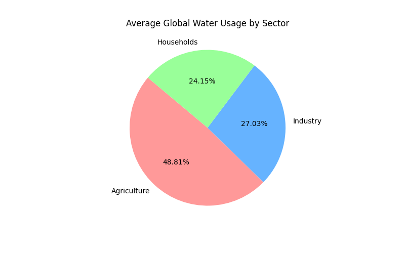
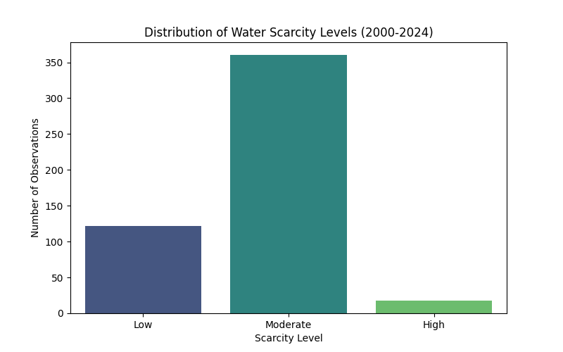

# Project of Data Visualization (COM-480)

| Student's name | SCIPER |
| -------------- | ------ |
|Istepanyan Anna | 327977|
|Mohammad Massi|394309|
|Oh Yoojin|423070|

[Milestone 1](#milestone-1) • [Milestone 2](#milestone-2) • [Milestone 3](#milestone-3)

## Milestone 1 (20th March, 5pm)

**10% of the final grade**

This is a preliminary milestone to let you set up goals for your final project and assess the feasibility of your ideas.
Please, fill the following sections about your project.

*(max. 2000 characters per section)*

### Dataset

> Find a dataset (or multiple) that you will explore. Assess the quality of the data it contains and how much preprocessing / data-cleaning it will require before tackling visualization. We recommend using a standard dataset as this course is not about scraping nor data processing.
>
> Hint: some good pointers for finding quality publicly available datasets ([Google dataset search](https://datasetsearch.research.google.com/), [Kaggle](https://www.kaggle.com/datasets), [OpenSwissData](https://opendata.swiss/en/), [SNAP](https://snap.stanford.edu/data/) and [FiveThirtyEight](https://data.fivethirtyeight.com/)).

For our project, we chose the dataset *cleaned_global_water_consumption.csv*, which focuses on global water usage and environmental indicators. It covers 20 countries over a period of 25 years, from 2000 to 2024.

The dataset includes 10 variables, such as total water consumption, per capita usage, and the distribution of water across agriculture, industry, and households. It also contains environmental indicators like rainfall impact, groundwater depletion, and water scarcity levels (Low, Moderate, High). These variables help us analyze trends over time, compare countries, and better understand how water usage relates to environmental stress.

We also evaluated the quality of the dataset before starting the visualizations. The data is clean and well-structured, with no missing values and correctly formatted data types. As a result, only minimal preprocessing is needed, mainly grouping the data by country and filtering specific time periods.

**Dataset source:** [Global Water Consumption Dataset 2000-2024 (Kaggle)](https://www.kaggle.com/datasets/atharvasoundankar/global-water-consumption-dataset-2000-2024?resource=download)

### Problematic

> Frame the general topic of your visualization and the main axis that you want to develop.
> - What am I trying to show with my visualization?
> - Think of an overview for the project, your motivation, and the target audience.
>
Water is an essential resource on which people depend in their daily lives, whether directly for consumption or indirectly for the production of goods such as food. However, due to the effects of climate change, water scarcity is becoming a growing concern in certain regions of the world, where rainfall levels are falling and glacial reserves are shrinking.

This project aims to explore how water consumption patterns, sectoral distribution (agriculture, industry and households) and environmental factors influence water scarcity in different countries over time. Our motivation is to better understand the factors driving water scarcity, as water is one of the most essential resources for human life and economic activity.

The visualisation is intended for a general audience interested in environmental issues, with the aim of raising awareness of the causes of water scarcity and highlighting global inequalities in water use.

Therefore, our problematic is: **How does water consumption and its distribution across sectors contribute to water scarcity levels across countries over time?**

### Exploratory Data Analysis

> Pre-processing of the data set you chose
> - Show some basic statistics and get insights about the data
>
Our initial check showed that the dataset *cleaned_global_water_consumption.csv* is well-structured, with 500 observations across 10 variables. There are no missing values or duplicates, and the data types are already correctly formatted. As a result, only minimal preprocessing was required, mainly grouping the data by country and year for visualization.

## Basic statistics and insights

To better understand global water usage, we created initial visualizations to highlight key patterns.

As shown in Figure 1, water consumption is largely dominated by agriculture, which accounts for about 50.18% on average. Industry represents 27.79%, while households account for 24.83%. In some cases, this imbalance is even more pronounced for example, in Argentina, agricultural usage reached 66.52% in 2020.

Figure 2 illustrates the distribution of water scarcity levels across all countries and years. Most observations fall under a *Moderate* level (72%), followed by *Low* (24.4%) and *High* (3.6%). The average groundwater depletion rate is 2.57%, although some regions experience more critical conditions. For instance, Mexico reached a peak depletion rate of 4.32% in 2012.

Overall, these results highlight the imbalance between high agricultural demand and environmental sustainability.

### Related work

> - What others have already done with the data?
> - Why is your approach original?
> - What source of inspiration do you take? Visualizations that you found on other websites or magazines (might be unrelated to your data).
> - In case you are using a dataset that you have already explored in another context (ML or ADA course, semester project...), you are required to share the report of that work to outline the differences with the submission for this class.

Several existing analyses have explored global water consumption data through Machine Learning and Exploratory Data Analysis.
One example is [Global Water Consumption Forecasting](https://www.kaggle.com/code/sarazahran1/global-water-consumption-forecasting), which focuses on predicting future water consumption trends using historical data and a Convolutional Neural Network model. This approach is useful for estimating future demand but mainly emphasizes forecasting accuracy rather than exploratory understanding of global patterns.

Another one is [Global Water Consumption Analysis](https://www.kaggle.com/code/ahmedashraf299/global-water-consumption-analysis), which performs exploratory data analysis using multiple visualizations. They include correlation heatmaps, time trends by country, choropleth map of global water consumption over time, etc. These visualizations provide useful insights into the dataset but remain mostly a collection of loosely connected plots.

Our project aims to extend these related works by providing an interactive and integrated visual exploration experience. Rather than presenting a set of independent plots, we design connected visualizations that link maps, temporal trends, and cross-country comparisons. This allows users to actively interact with the visualizations and explore water consumption patterns according to their interests.

In addition to detailed visualizations of specific statistics (e.g., information for individual countries), our system also provides integrated views that offer an intuitive overview of global water consumption patterns. By combining both granular and high-level perspectives, we aim to reveal new insights into water consumption across countries and regions. Furthermore, we incorporate user interface considerations into the design so that users can interact with the visualizations comfortably and explore the data in a clear and accessible way.

## Milestone 2 (17th April, 5pm)

**10% of the final grade**
You can find our team's Milestone 2 report [here](./Milestone/Milestone_2_AquaViz.pdf)

## Milestone 3 (29th May, 5pm)

**80% of the final grade**

## Late policy

- < 24h: 80% of the grade for the milestone
- < 48h: 70% of the grade for the milestone

